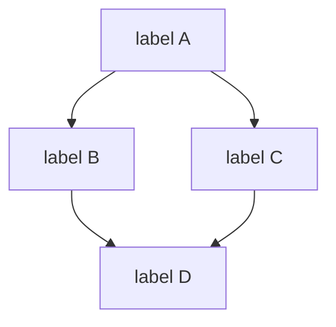
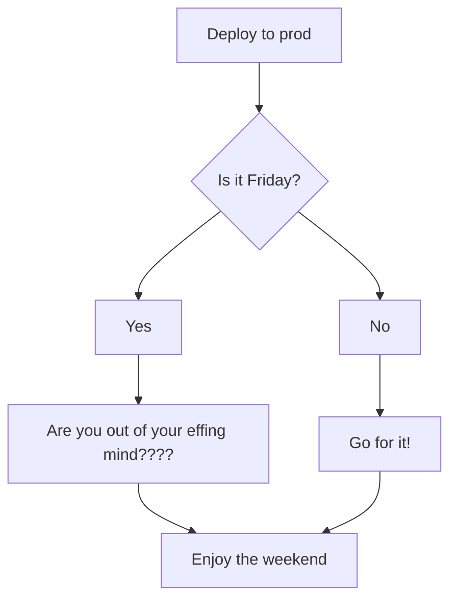

# test-new-gh-stuff
If you can't tell from the name....

# Mermaid

```mermaid
graph TD;
    A[label A]-->B[label B];
    A-->C[label C];
    B-->D[label D];
    C-->D;
```

```mermaid
flowchart TD;
A[Deploy to prod]-->B{Is it Friday?};
B-->Yes-->C[Are you out of your effing mind????];
B-->No-->D[Go for it!];
C-->E[Enjoy the weekend];
D-->E;
```
